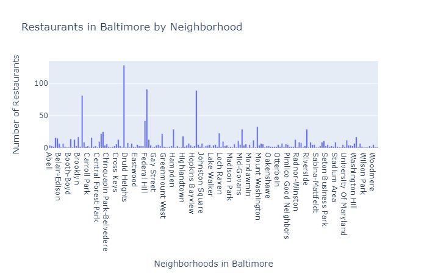

# Restaurants-in-Baltimore
This dataset contains a list of restaurants within Baltimore City and was used to find the number of restaurants in Baltimore by neighborhood and zip code. 

The repository contains excel files with the original downloaded data and a Jupyter Notebook file which analyzed and plotted the data using plotly visualization. 

# Brief description of findings and background data:
I decided to look at restaurants in Baltimore. I currently live in Baltimore and feel I eat at the same few restaurants, so I wanted to see how many restaurants there were in the city and in what areas. The data showed that Downtown (near Druid Heights on the plot but Python did not label it) had the most restaurants with 128, and where I live (Roland Park) has 9. The zipcode of 21224 has the most restaurants, and where I live (21210) has 23. My initial thought is the benefits of this is that if people want to go out and find an area with the most food options, they can use this data to find the zip code or neighborhood destination they desire. For this, Excel actually might have been better for the Pivot Tables, however in Python I was able to use both by extracting data from the spreadsheets, uploaded in the repositories, and then making the graphs.

# Outline:
Industry question: What area in Baltimore City (neighborhood or zip code) has the most restaurants?
Data question: What data is available and what tools can be used to answer this industry question?
Data answer: There is data found within Baltimore City Open Data on restaurants, their names, and their locations throughout the city. Creation of pivot tables and plotting can help answer this data question.
Industry answer process and findings: The data is able to show us areas with the most and least restaurants in the city. This could be helpful for someone moving to Baltimore as they may or may not want to be by a lot of restaurants, which could mean the area is busy, or someone visiting and wanting to know the best area to stay where they will have the most food options. 

# Website links:
Where to find the data source: https://data.baltimorecity.gov/Culture-Arts/Restaurants/k5ry-ef3g
Where the data source can be downloaded specifically: https://data.baltimorecity.gov/Culture-Arts/Restaurants/k5ry-ef3g/data
